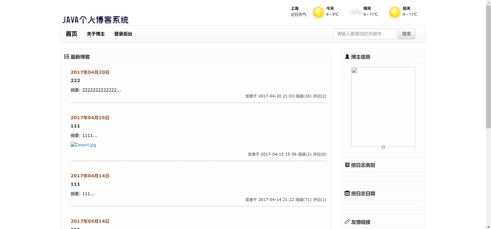
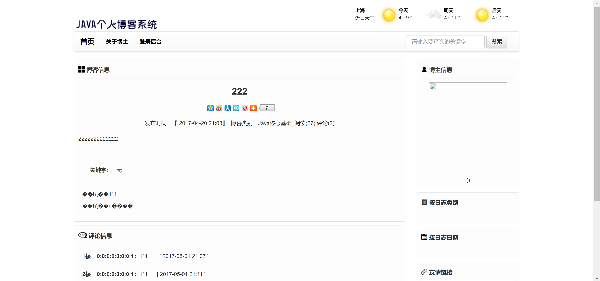
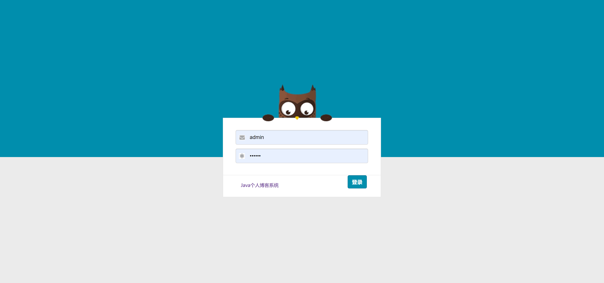
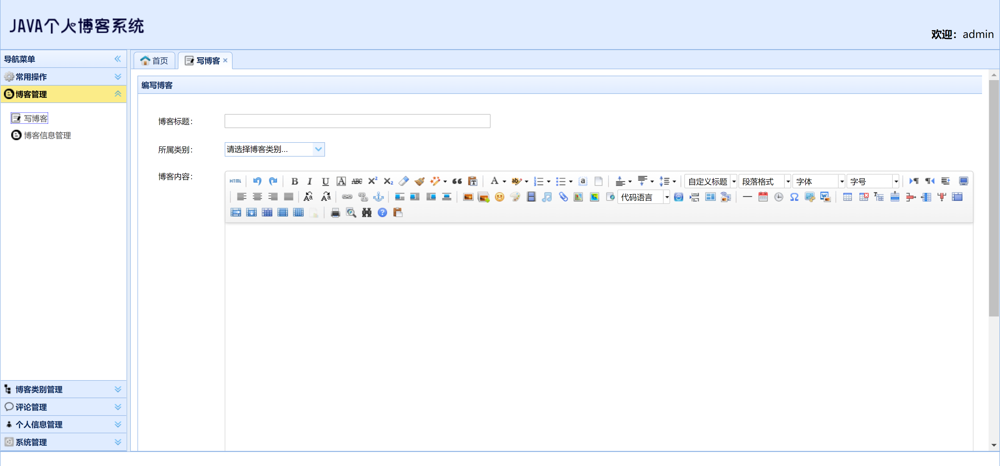
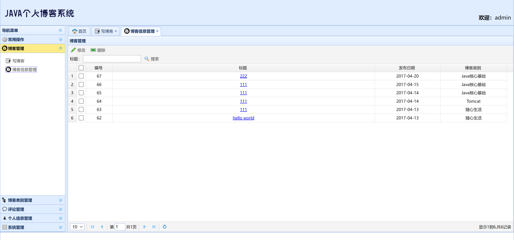
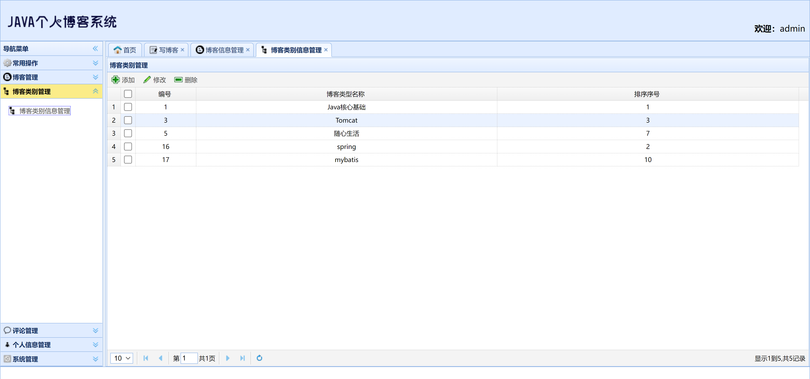
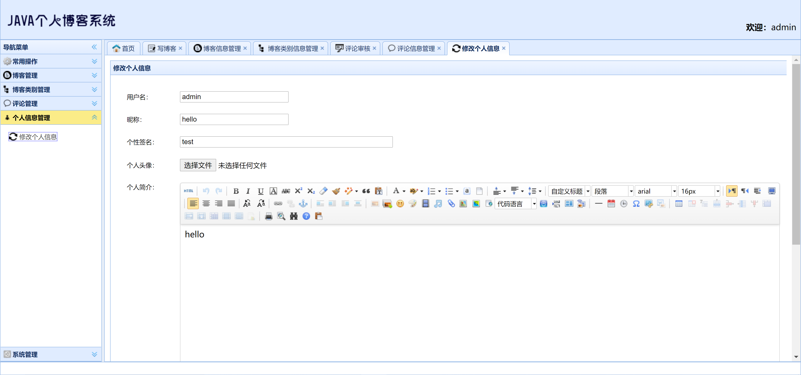
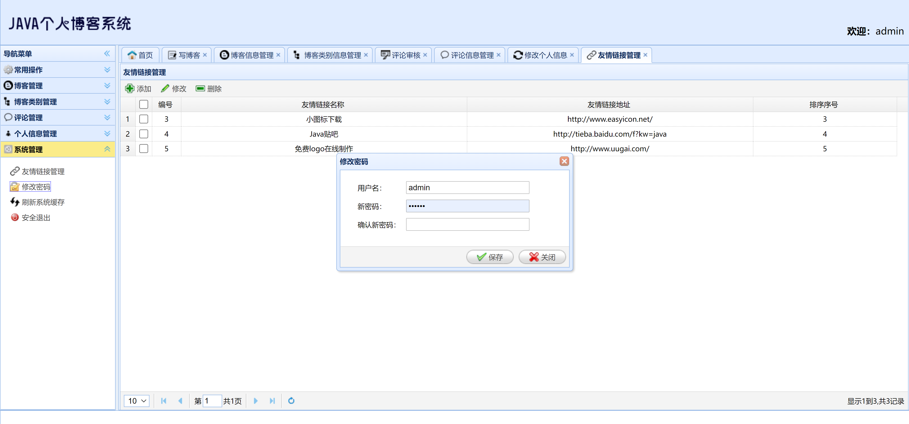

<h1 align="center">JAVA个人博客管理系统</h1>

## 简介
JAVA个人博客管理系统：集成博客、分类、用户、评论管理功能，提供文章创作、分类组织、安全登录、个性化信息编辑等多样化博客管理操作，实现便捷的博客维护与管理。    --计算机毕业设计源码；毕设源码；java毕业设计源码

## 联系方式

<h3 align="center">获取完整代码与数据库文件 + 微信：deepguan QQ: 86050149 QQ群: 783742310</h3>

<h3 align="center">可帮忙远程部署 包运行成功！提供远程部署、修改代码、设计文档指导、代码讲解等服务！</h3>

## 功能介绍（完整见运行截图）
管理员： 基本功能包括用户注册、登录和权限管理。博客管理模块支持撰写、编辑、分类和标签功能，分类管理用于创建和管理博客分类。还可进行评论审核、友情链接管理及系统设置，同时允许修改个人信息如用户名、头像和个性签名。 用户： 基本功能是注册、登录和退出。主页提供博客概览、最新文章和热门推荐。可以通过类别或日期筛选日志，查看博主信息。用户可以撰写和编辑博客，按类别查看，并通过评论模块参与交流，支持个人信息修改。

## 运行截图

本代码来源于网络,仅供学习参考使用!

